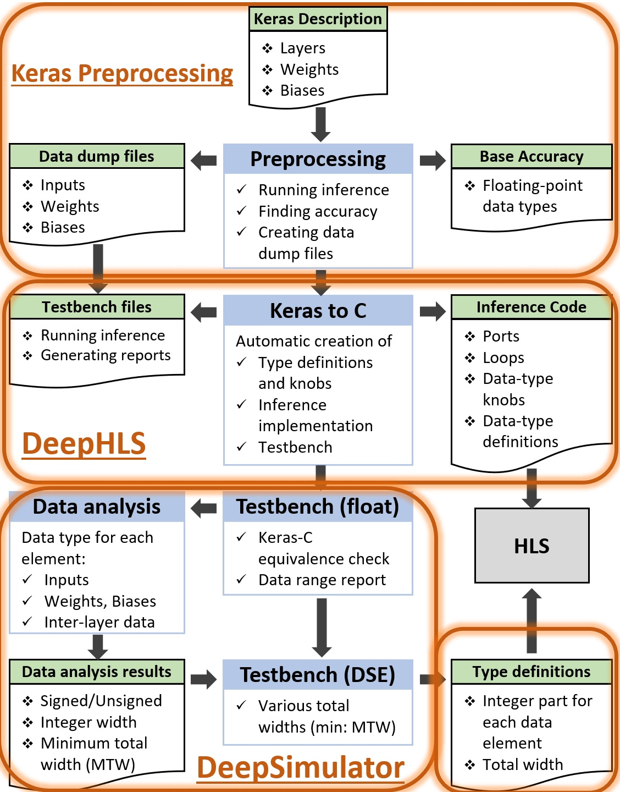

# DeepHLS
DeepHLS is an open source automatic tool to convert a Deep Neural Network described in Keras to a C implementation synthesizable by High-Level Synthesis tools. 

# Citing us
If you find this work helpful for your research, please consider citing our paper published in The 27th IEEE International Conference on Electronics, Circuits and Systems (ICECS), 2020.

```
Riazati, Mohammad, Masoud Daneshtalab, Mikael Sjödin, and Björn Lisper. "DeepHLS: A complete toolchain for automatic synthesis of deep neural networks to FPGA." In The 27th IEEE International Conference on Electronics, Circuits and Systems (ICECS), pp. 1-4. IEEE, 2020.
```

# Description
This tool is part a toolchain to generate a C implementation of a Deep Neural Network suitable to be synthesized by HLS.  
The toolchain comprises various tools and stages to create proper C version. Here is a quick summary of each stage.

Figure below shows an overview of the whole toolchain. The current repository is the implementation for the "Keras to C" tool.



#### Preprocessing:
* This stage is optional if only the conversion to C is needed and no verification or Fixed-point 
analysis is going to be performed.

Preprocessing stage is implemented in Python to enable the extraction of the data seamlessly
in the same environment that the neural network is implemented and trained. 
In this stage, input data (e.g., images), weights, and biases of an existing and trained DNN 
are converted to multidimensional arrays in standard C format. 
Another output of this stage is the base accuracy of the
DNN using these specific input data, weights, and biases.

#### Keras to C (this repository):
This stage is the main part of creating the C implementation. 
In this stage, Keras implementation is processed to extract all the required information. 
A DNN description in Keras is relatively concise, 
and most of the information about the layers is not explicitly provided. 
However, to generate a C code, it is necessary to have various information about the network layers, 
including layer type (e.g., convolutional or fully connected), 
the number of filters, kernel size, stride size, padding type (valid or same),
type of activation function (e.g., relu), and layer input and output sizes. 
They can either be directly extracted from the Keras function for a specific layer or by analyzing previous layers. 
In this stage, two outputs are created. The first output is the C implementation of the DNN inference that is ready to be synthesized on the FPGA by the HLS tool. It includes ports, loops, data definitions, etc. It also comes with several knobs in order to simply switch between various data types. These knobs and how they can be set are explained later. The second output is testbench files. Testbench, like a wrapper, is placed around the inference code, and in addition to applying input data (e.g., input image), is responsible for monitoring and recording inputs, outputs, and internal values of the network, and it ultimately creates the necessary reports.

In creating C implementation, several measures are taken to enhance the usability and performance of the circuit which is being generated based on it:
* The first and most crucial aspect to consider is that the code is created such that 
it can be adequately synthesized on an FPGA. 
* The generated C code is able to use various data types for each of the data elements, 
such as inputs, outputs, weights, biases, and layer data, through easy-to-use knobs.
* The code created for inference does not only perform the main math operations but also embodies features that, 
when the testbench executes it, it can monitor and save all the data elements. 
They are required in the future stages. 
* In a neural network, different data elements, including inputs, outputs, biases, weights, and layer data, are needed. 
In the case of layer data, both internal FPGA storage (such as BRAM) and external memory (such as DDR) can be used. 
In C code generation, both of these approaches are supported to be able to implement 
even very large networks with many layers or large layers dimensions.
* All for-loops have labels. This will lead to more readable HLS reports. 
Additionally, it allows the designers or tool developers to use external 
HLS directive files, e.g., directives.tcl file for Xilinx Vivado HLS.

#### Running testbench in floating-point mode
* This stage is optional if only the conversion to C is needed and no verification or Fixed-point 
analysis is going to be performed.

Testbench, like a wrapper, is placed around the inference code and connects the input and output data to it. 
It reads the data through a file-to-memory mechanism to support very large networks and datasets like VGG and ImageNet.

#### Data Analysis and Design Space Exploration
* This stage is optional if only the conversion to C is needed and no verification or Fixed-point 
analysis is going to be performed.

At this stage, various data that were extracted and stored in the stage of running testbench are analyzed 
to select appropriate data types. 
The required knobs to determine the type of data for each of the elements in the network 
are already integrated into the code, and in this stage (and the next), we are going to find how to adjust those knobs.
Data elements include inputs, outputs, weights, biases, and data for each layer separately.

One of the three modes for the implementation and execution of the inference can be selected.

* Floating-point mode: For all data elements in the DNN, the FlP data type is chosen.
* Single Fixed-point mode: A Fixed-point data type configuration 
(number of bits in its integer portion (I), number of bits in its fractional portion (F), and signedness (S)). 
In this mode, all data types have the same FxP configuration, i.e., identical W, I. 
In this mode, all data types are signed. 
* Multiple Fixed-point mode: In this mode, like the previous mode, FxP data type is used for all data elements, 
with the difference that each of the FxP types can have different I and S. 

# Compilation
The tool is built and tested in:
* Microsoft Visual Studio 2019 
* Linux Ubuntu 22.04 (g++ 11.3.0)

```
g++ -g *.*pp --std c++17 -o deephls
```

# Example Runs
## Defaul Run
```
..> deephls
```
This runs DeepHLS using all default settings on keras-source.py in the current directory.

## Testbench main function
```
..> deephls -add-main-function
```
In addition to the inference code, which is supposed to be synthesized by HLS, the main function is added to the generated code. The main function reads the input images and feeds them to the inference code. Besides, some additional tasks, e.g., execution time calculator, are performed.

## Storing values needed by data analysis 
```
..> deephls -add-main-function -store-analysis-data
```
Values of all network data elements, including wights, biases, layer data, etc., are stored and summarized. One application of these values is to determine suitable quantization setting for each element. Since values are stored while inference is executed, "-store-analysis-data" will be ignored if "-add-main-function" is not supplied.

## Specifying loop orders
```
..> deephls -loop-orders oz-oy-ox-iz-kx-ky#*#*#*#*#*#*#*#*#*#*#*#*#*#*
```
The C version of each layer of a deep neural network consists of several loops. For instance, a convolutional layer consists of six loops:  
Output X (ox), Output Y (oy), Output Z (oz), Input Z (iz), Kernel X (kx), and Kernel Y (ky). 

For some reasons, especially when HLS is concerned, the designer might prefer a specific order for the loops. Using the `-loop-orders` parameter, the order of the loops can be specified. Layers are seperated by ``#``. To choose the defualt implementation, `*` can be used for a layer.

## Using a JSON file as the tool settings
The arguments for the program can be stored in a JSON file and supplied to the tool. Some example JSON files can be found in the Examples folder.
* Linux:
```
 ./deephls -options-json-file Examples/lenet.json 
```
